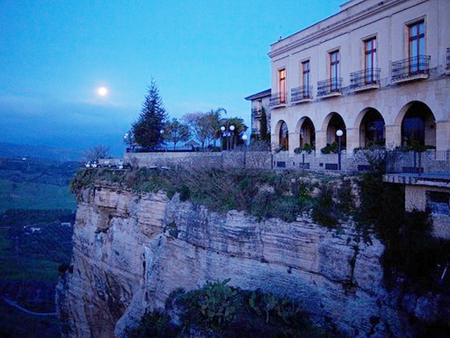
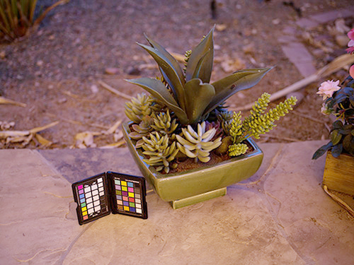

# Zero-DCE TF
The Tensorflow Implementation of the [Zero-Reference Deep Curve Estimation for Low-Light Image Enhancement](https://openaccess.thecvf.com/content_CVPR_2020/papers/Guo_Zero-Reference_Deep_Curve_Estimation_for_Low-Light_Image_Enhancement_CVPR_2020_paper.pdf) - CVPR 2020

## Update:
I pushed my project to Google Cloud Platform. May need more improvement. Should you have any comment or inquiries or just basically want to enhance your images, give it a try [here](http://34.64.150.58/)
## Content
- [Zero-DCE](#zero-dce-tf)
- [Getting Started](#getting-tarted)
- [Running](#running)
- [References](#references)
- [Citations](#citation)
- [Try Yourself](#try-on-web)

## Getting Started

- Clone the repository

### Prerequisites

- Tensorflow 2.2.0+
- Python 3.6+
- Keras 2.3.0
- PIL
- numpy

```python
pip install -r requirements.txt
```

## Running
### Training 
- Preprocess
    - Download the training data at [Google Drive](https://drive.google.com/file/d/1HiLtYiyT9R7dR9DRTLRlUUrAicC4zzWN/view).

    - Run this file to generate data. (Please remember to change path first)

    ```
    python src/prepare_data.py
    ```

- Train ZERO_DCE 
    ```
    python train.py
    ```

- Test ZERO_DCE
    ```
    python test.py
    ```
## Usage
### Training
```
python train.py [-h] [--lowlight_images_path LOWLIGHT_IMAGES_PATH] [--lr LR]
                [--num_epochs NUM_EPOCHS] [--train_batch_size TRAIN_BATCH_SIZE]
                [--val_batch_size VAL_BATCH_SIZE] [--display_iter DISPLAY_ITER]
                [--checkpoint_iter CHECKPOINT_ITER] [--checkpoints_folder CHECKPOINTS_FOLDER]
                [--load_pretrain LOAD_PRETRAIN] [--pretrain_dir PRETRAIN_DIR]
```

```
optional arguments: -h, --help                show this help message and exit
                    --lowlight_images_path    LOWLIGHT_IMAGES_PATH
                    --lr                      LR
                    --num_epochs              NUM_EPOCHS
                    --train_batch_size        TRAIN_BATCH_SIZE
                    --val_batch_size          VAL_BATCH_SIZE
                    --display_iter            DISPLAY_ITER
                    --checkpoint_iter         CHECKPOINT_ITER
                    --checkpoints_folder      CHECKPOINTS_FOLDER
                    --load_pretrain           LOAD_PRETRAIN
                    --pretrain_dir            PRETRAIN_DIR
```

### Testing
```
python test.py [-h] [--lowlight_test_image_path]
```
```
optional arguments: -h, --help                    show this help message and exit
                    --lowlight_test_image_path    LOWLIGHT_TEST_IMAGES_PATH
```

#### Result
 |  |
|:---:|:---:|
 |  |
 |  |
 |  |
 |  |
| input | output |

## License

This project is licensed under the MIT License - see the [LICENSE](https://github.com/tuvovan/Zero_DCE_TF/blob/master/LICENSE) file for details

## References
[1] Zero-Reference Deep Curve Estimation for Low-Light Image Enhancement - CVPR 2020 [link](https://openaccess.thecvf.com/content_CVPR_2020/papers/Guo_Zero-Reference_Deep_Curve_Estimation_for_Low-Light_Image_Enhancement_CVPR_2020_paper.pdf)

[3] Low-light dataset - [link](https://drive.google.com/file/d/1HiLtYiyT9R7dR9DRTLRlUUrAicC4zzWN/view)

## Citation
```
    @misc{guo2020zeroreference,
    title={Zero-Reference Deep Curve Estimation for Low-Light Image Enhancement},
    author={Chunle Guo and Chongyi Li and Jichang Guo and Chen Change Loy and Junhui Hou and Sam Kwong and Runmin Cong},
    year={2020},
    eprint={2001.06826},
    archivePrefix={arXiv},
    primaryClass={cs.CV}
}
```

## Try on web
The project is now available on GCP. [Give it a try](http://34.64.150.58/)
## Acknowledgments

- This repo is the re-production of the original pytorch [version](https://github.com/Li-Chongyi/Zero-DCE)
- Thank you for helping me to understand more about pains that tensorflow may cause.
- Final words:
    - Any ideas on updating or misunderstanding, please send me an email: <vovantu.hust@gmail.com>
    - If you find this repo helpful, kindly give me a star.

